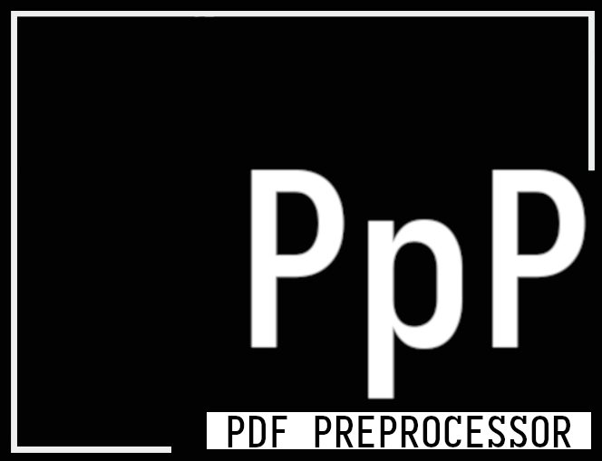

# Pdf preProcessor - PpP



```
Process PDF content easily
```

* An ``stb-style header only library`` for extracting data out of pdf files

--- 

## Quick Start

* copy [ppp.h](./ppp.h) into your project and include it like this:
```c
#define PPP_IMPLEMENTATION
#include "./ppp.h"
```

---

## Usage 

### Convert a pdf to plaintext
* ```ppp_pdf_to_text(char* path, char** text)```
* Stores pdf as plaintext into the provided char[] pointer (string pointer)
* Under the hood it uses linux command ```pdftotext <path-to-pdf> --raw -``` that converts the the pdf at given path to text and prints it on stdout. The stdout is then stored at the provided char[] pointer. 
```c
char *path = "./path-to-pdf";
char *text = "";
ppp_pdf_to_text(path, &text);
```


---

## Build Examples

---

## References 
- sv.h: https://github.com/tsoding/sv/tree/master 
